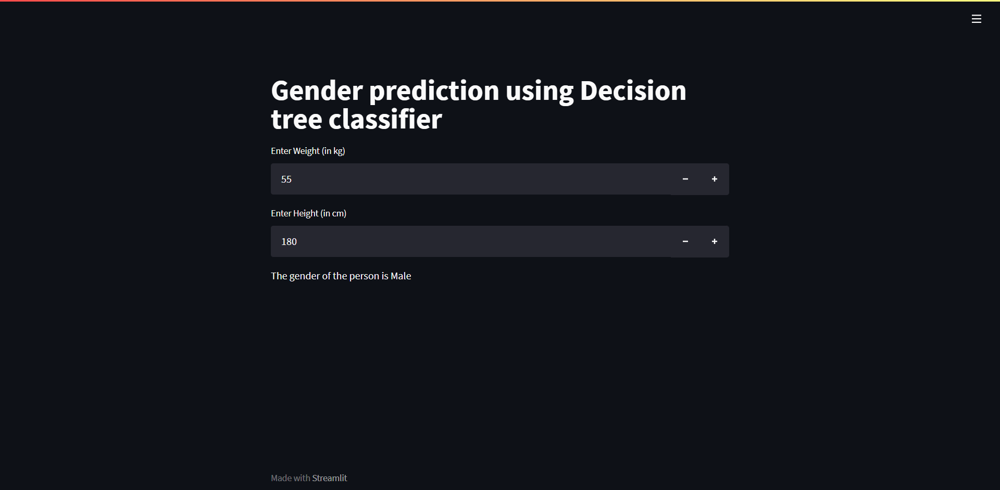

# Gender prediction using Decision tree classifier


# Welcome to Streamlit :wave:

**The fastest way to build and share data apps.**

Streamlit lets you turn data scripts into sharable web apps in minutes, not weeks. It’s all Python, open-source, and free! And once you’ve created an app you can use our [cloud platform](https://streamlit.io/cloud) to deploy, manage, and share your app!



## Installation

```bash
pip install streamlit
streamlit hello
```

Streamlit can also be installed in a virtual environment on [Windows](https://github.com/streamlit/streamlit/wiki/Installing-in-a-virtual-environment#on-windows), [Mac](https://github.com/streamlit/streamlit/wiki/Installing-in-a-virtual-environment#on-mac--linux), and [Linux](https://github.com/streamlit/streamlit/wiki/Installing-in-a-virtual-environment#on-mac--linux).


## The Streamlit GitHub badge

Streamlit's GitHub badge helps others find and play with your Streamlit app.

[](https://share.streamlit.io/streamlit/demo-face-gan)

Once you deploy your app, you can embed this badge right into your GitHub readme.md as follows:

```markdown
[](https://share.streamlit.io/yourGitHubName/yourRepo/yourApp/)
```


## Streamlit Cloud

[Streamlit Cloud](https://streamlit.io/cloud) is our deployment solution for managing, sharing, and collaborating on your Streamlit apps.

- The Teams and Enterprise tiers provide secure single-click deploy, authentication, web editing, versioning, and much more for your Streamlit apps. You can sign-up [here](https://share.streamlit.io/signup).
- The Community tier (formerly Streamlit sharing) is the perfect solution if your app is hosted in a public GitHub repo and you’d like anyone in the world to be able to access it. It's completely free to use and you can sign-up [here](https://share.streamlit.io).

## License

Streamlit is completely free and open-source and licensed under the [Apache 2.0](https://www.apache.org/licenses/LICENSE-2.0) license.
